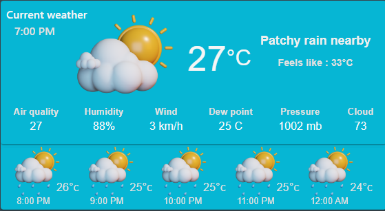
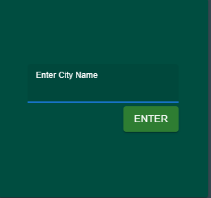

# Weather App

## Tech Stack Used

- ⚡Api to fetch Weather Forecast Deatais .
- 🚀 React for ther frontend .
    - 💃  Using javascript , Hooks , Proops , vites and other parts of a modern frontend stack
    - 🎨 Material-ui for frontend component

## Forecast Details 
- Displays Current Weather Temperature details and next 5 Hours also .
- Including Humidity , Wind Speed , Pressure , Dew Point , Cloud and Air Quality .
- And Udates with current condition Cloudy or Patchy Rain or Mist or Thunder Strike .

  

## Detail of your specified Location 
- Let the User Know about the Country Name , State Name and City .
- The Longitue and Latitude of the location

  .png)

## Input Field 
- Allow User  to  know Forecast Details of any City .
- Takes the Input and Render the   the information immediately .

   
  
# React + Vite

This template provides a minimal setup to get React working in Vite with HMR and some ESLint rules.

Currently, two official plugins are available:

- [@vitejs/plugin-react](https://github.com/vitejs/vite-plugin-react/blob/main/packages/plugin-react/README.md) uses [Babel](https://babeljs.io/) for Fast Refresh
- [@vitejs/plugin-react-swc](https://github.com/vitejs/vite-plugin-react-swc) uses [SWC](https://swc.rs/) for Fast Refresh
